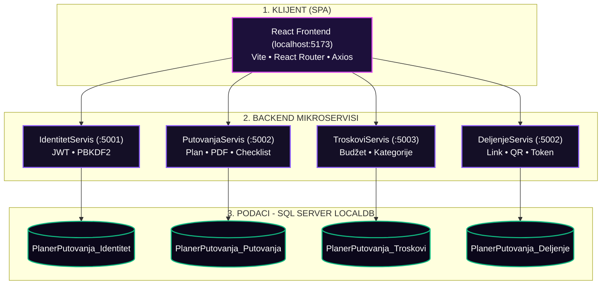

# Voyager Travel Planner - System Architecture

Ovaj dokument opisuje sistemsku arhitekturu aplikacije Voyager Travel Planner, strukturiranu kao sistem mikroservisa sa pristupom *database-per-service*.

---

## Dijagram sistemske arhitekture (Mermaid Šema)

---

## Opis komponenti i slojeva

### 1. KLIJENT (Frontend)
- **Tehnologije**: React (Single Page Application - SPA), Vite za build okruženje, React Router za navigaciju kroz stranice i Axios/Fetch za API komunikaciju.
- **Lokalni port**: `localhost:5173`.
- **Zadatak**: Pružanje interfejsa za registrovanog korisnika, gosta i administratora. Komunicira sa backend servisima asinhronim HTTP pozivima.

### 2. BACKEND (Mikroservisi)
Aplikacija je podeljena na 4 logička mikroservisa (koja se u lokalnom razvoju pokreću kroz 3 procesa):
1. **IdentitetServis (Port 5001)**:
   - Zadužen za bezbednost, registraciju, prijavu i izdavanje JWT (JSON Web Tokena).
   - Lozinke se hešuju koristeći PBKDF2/BCrypt algoritam.
2. **PutovanjaServis (Port 5002)**:
   - Upravlja kreiranjem putovanja, spiskovima za pakovanje (checklist), i generisanjem PDF izveštaja za putovanje.
3. **TroskoviServis (Port 5003)**:
   - Zadužen za evidenciju i sabiranje troškova po kategorijama, kao i praćenje preostalog i planiranog budžeta.
4. **DeljenjeServis (Port 5002)**:
   - Upravlja deljenim pristupom, tokenima za deljenje, kreiranjem QR kodova i praćenjem nivoa pristupa (VIEW/EDIT). Hostovan je u sklopu servisa putovanja.

### 3. PODACI (SQL Server LocalDB)
Sistem se striktno pridržava **database-per-service** pravila. Svaki mikroservis ima svoju bazu podataka u lokalnoj instanci SQL Servera:
- `PlanerPutovanja_Identitet`: Čuva informacije o korisnicima, lozinkama i ulogama.
- `PlanerPutovanja_Putovanja`: Čuva osnovne planove i stavke pakovanja.
- `PlanerPutovanja_Troskovi`: Čuva podatke o troškovima i budžetu putovanja.
- `PlanerPutovanja_Deljenje`: Čuva tokene za deljenje i nivoe pristupa.

---

## Ključna arhitektonska pravila

* 🗄️ **Izolacija podataka**: Svaki mikroservis ima sopstvenu bazu podataka, a struktura se automatski podešava pomoću **EF Core migracija** pri startup-u.
* 🔑 **Logičke reference**: Između tabela u različitim bazama ne postoje strani ključevi (Foreign Keys) na nivou SQL baze. Veze se ostvaruju isključivo logički preko **GUID** (npr. `TravelPlanId` u bazi troškova referencira putovanje u bazi putovanja).
* 🛡️ **Interna komunikacija**: Komunikacija između servisa na internim endpoint-ima je zaštićena posebnim sigurnosnim zaglavljem `X-Interni-Kljuc`.
