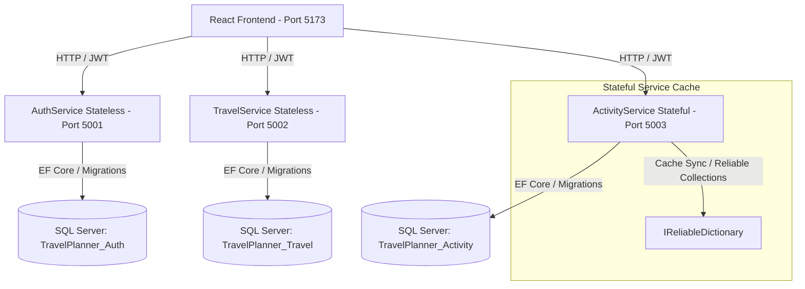

# Voyager Travel Planner - System Architecture

This document describes the system architecture of the Travel Planner application, structured as a microservices application designed for the **Microsoft Service Fabric** platform, with fallback execution for local development.

---

## High-Level Architecture Diagram

---

## Architectural Components

### 1. Frontend Client
- **Technology Stack**: React, Vite, CSS, Lucide icons.
- **State Management**: React Context API (`AuthContext`, `TravelPlanContext`) to handle auth sessions, routes, plans, destinations, packing lists, and sharing tokens globally.
- **HTTP Call Services**: Decoupled HTTP service wrappers (`AuthService.js`, `TravelService.js`, `ActivityService.js`) injected/imported into components.
- **Models**: Explicit client-side models (`User`, `TravelPlan`, `Destination`, `PackingItem`, `Activity`, `Expense`) representing data structures.
- **Environment Variables**: Reads service base URLs from `.env` dynamically.

### 2. AuthService (Stateless Service)
- **Responsibility**: User registration, authentication, JWT issuing, role management (User, Admin).
- **Service Fabric Type**: Stateless Service.
- **Local Dev Port**: 5001.
- **Persistence**: SQL Server LocalDB (`MSSQLLocalDB`, database `TravelPlanner_Auth`).
- **Security**: Password hashing using BCrypt. JWT signature validation.

### 3. TravelService (Stateless Service)
- **Responsibility**: Travel plans CRUD, destinations CRUD, checklist/packing list CRUD, share token generation.
- **Service Fabric Type**: Stateless Service.
- **Local Dev Port**: 5002.
- **Persistence**: SQL Server LocalDB (`MSSQLLocalDB`, database `TravelPlanner_Travel`).
- **Validation**: Enforces `EndDate >= StartDate` for plans and destinations. Ensures destinations fit within overall travel dates.
- **Cascading Deletes**: Deleting a travel plan deletes all associated destinations, packing items, and share permissions cascadingly in the database.

### 4. ActivityService (Stateful Service)
- **Responsibility**: Day-by-day activity scheduling, expense tracking, and real-time budget calculations.
- **Service Fabric Type**: Stateful Service.
- **Local Dev Port**: 5003.
- **Persistence**: SQL Server LocalDB (`MSSQLLocalDB`, database `TravelPlanner_Activity`).
- **Stateful Management**: Uses Service Fabric `IReliableDictionary` stateful cache to store and update active plan budgets, total expenses, and estimated activity costs. If a cache miss occurs, the service queries SQL Server database, updates the `IReliableDictionary` in-memory state, and returns calculations in sub-millisecond speeds.
- **Local Fallback**: If running outside Service Fabric (standalone dev mode), it falls back to an in-memory thread-safe `ConcurrentDictionary` state cache.

---

## Database Architecture
We enforce a **Database-Per-Service** pattern:
- **`TravelPlanner_Auth`**: Contains `Users` table. Seeds an initial system administrator user (`admin@travelplanner.com` / `adminpassword`) on migration creation.
- **`TravelPlanner_Travel`**: Contains `TravelPlans`, `Destinations`, `PackingListItems`, and `TravelPlanShares` tables. Includes cascade foreign keys.
- **`TravelPlanner_Activity`**: Contains `Activities` and `Expenses` tables.

Migrations are fully generated using Entity Framework Core and run programmatically on service startup, ensuring that the local SQL Server databases are initialized automatically without manual developer steps.
