# Voyager Travel Planner - Use Case Analysis

Ovaj dokument opisuje aktere i slučajeve korišćenja (Use Case-ove) sistema za planiranje putovanja Voyager.

---

## Use Case Dijagram (Mermaid Šema)

```mermaid
graph TD
    %% Akteri
    Korisnik((Registrovani korisnik))
    Admin((Administrator))
    Gost((Gost / Korisnik preko linka))

    subgraph "Sistem Planer Putovanja (Voyager)"
        subgraph "1. NALOG I PRISTUP"
            UC_Reg[Registracija]
            UC_Log[Prijava]
            UC_Out[Odjava]
            UC_Dash[Pregled dashboard-a<br/>statistika, budžet, putovanja]
        end

        subgraph "2. PUTOVANJA (SAMO SVOJA)"
            UC_List[Lista putovanja + pretraga]
            UC_Create[Kreiranje novog putovanja]
            UC_EditPlan[Izmena osnovnih podataka plana]
            UC_DelPlan[Brisanje putovanja]
            UC_Details[Otvaranje detalja putovanja]
        end

        subgraph "3. UNUTAR JEDNOG PUTOVANJA (TABOVI)"
            UC_Summary[Pregled - sumarni prikaz]
            
            subgraph "Destinacije"
                UC_AddDest[Dodavanje destinacije]
                UC_EditDest[Izmena destinacije]
                UC_DelDest[Brisanje destinacije]
            end

            subgraph "Aktivnosti (po danima)"
                UC_AddAct[Dodavanje aktivnosti]
                UC_EditAct[Izmena aktivnosti]
                UC_DelAct[Brisanje aktivnosti]
            end

            subgraph "Troškovi"
                UC_AddExp[Dodavanje troška]
                UC_EditExp[Izmena troška]
                UC_DelExp[Brisanje troška]
            end

            UC_Budget[Pregled budžeta<br/>planirano / potrošeno / preostalo]

            subgraph "Checklist"
                UC_AddPack[Dodavanje stavke]
                UC_CheckPack[Označavanje završene]
            end

            subgraph "Deljenje"
                UC_ShareLink[Kreiranje linka VIEW & EDIT]
                UC_CopyLink[Kopiranje linka]
                UC_QR[Prikaz QR koda]
                UC_DeactLink[Deaktivacija linka]
            end

            UC_Export[Izvoz PDF]
        end

        subgraph "4. ADMINISTRACIJA (SAMO ADMIN)"
            UC_AdminUsers[Pregled svih korisnika]
            UC_AdminRole[Promena uloge korisnika]
            UC_AdminDelUser[Brisanje korisnika]
            UC_AdminPlans[Pregled svih putovanja u sistemu]
            UC_AdminOpenOther[Otvaranje tuđeg putovanja<br/>ograničeno: samo ako je admin vlasnik]
        end
    end

    %% Veze za Registrovanog Korisnika
    Korisnik --> UC_Reg
    Korisnik --> UC_Log
    Korisnik --> UC_Out
    Korisnik --> UC_Dash
    Korisnik --> UC_List
    Korisnik --> UC_Create
    Korisnik --> UC_EditPlan
    Korisnik --> UC_DelPlan
    Korisnik --> UC_Details

    %% Inkluzije (include)
    UC_Details -.->|include| UC_Summary
    UC_Details -.->|include| UC_AddDest
    UC_Details -.->|include| UC_AddAct
    UC_Details -.->|include| UC_AddExp
    UC_Details -.->|include| UC_AddPack
    UC_Details -.->|include| UC_ShareLink
    UC_Details -.->|include| UC_Export

    %% Nasleđivanje (Generalizacija)
    Admin --> Korisnik
    Admin --> UC_AdminUsers
    Admin --> UC_AdminRole
    Admin --> UC_AdminDelUser
    Admin --> UC_AdminPlans
    UC_AdminPlans -.->|include| UC_AdminOpenOther

    %% Veze za Gosta (View i Edit)
    subgraph "Gost - VIEW Pristup (Samo pregled)"
        UC_GView[Pregled plana, destinacija, aktivnosti, troškova, checkliste i izvoz PDF]
    end
    subgraph "Gost - EDIT Pristup (Izmena)"
        UC_GEdit[Izmena destinacija, aktivnosti, troškova, checkliste i izvoz PDF]
    end

    Gost --> UC_GView
    Gost --> UC_GEdit
```

---

## Uloge i funkcionalnosti na sistemu

### 1. Registrovani korisnik (Korisnik)
Može upravljati svojim nalogom i putovanjima koja je sam kreirao:
- **Nalog i Pristup**: Registracija, prijava, odjava, i dashboard sa statistikom (ukupan budžet, broj putovanja).
- **Putovanja**: Kreiranje, izmena (naziv, datumi, budžet, opis, napomene), brisanje i lista sa pretragom.
- **Unutar detalja putovanja (Tabovi)**:
  - **Pregled**: Sumarni prikaz plana.
  - **Destinacije**: Dodavanje, izmena i brisanje.
  - **Aktivnosti**: Dodavanje, izmena i brisanje po danima.
  - **Troškovi**: Evidentiranje pojedinačnih troškova i automatski proračun budžeta.
  - **Checklist**: Lista za pakovanje i označavanje spakovanih stvari.
  - **Deljenje**: Generisanje linkova (za pregled ili izmenu), kopiranje linka, prikaz QR koda i deaktivacija.
  - **Izvoz PDF**: Preuzimanje kompletnog plana u PDF formatu.

### 2. Administrator (Admin)
Nasleđuje sve funkcionalnosti registrovanog korisnika, i dodatno ima administratorski panel:
- **Korisnici**: Pregled svih registrovanih korisnika, promena uloge (Korisnik <-> Admin), i brisanje korisnika.
- **Planovi**: Pregled svih putovanja u sistemu i otvaranje detalja tuđeg putovanja (samo ako je admin vlasnik ili ima pristup).

### 3. Gost (Korisnik preko linka)
Korisnik koji pristupa planu bez prijave, isključivo preko generisanog linka/QR koda:
- **VIEW pristup (Samo pregled)**: Vidi osnovne podatke, destinacije, aktivnosti, troškove, checklistu, i može preuzeti PDF. Ne vidi tab za deljenje i ne može vršiti izmene niti brisanje.
- **EDIT pristup (Izmena)**: Pored pregleda, može vršiti izmene nad destinacijama, aktivnostima, troškovima i checklistom. Ne može menjati osnovne podatke plana (naziv, datumi, budžet), tab za deljenje mu nije dostupan, i ne može obrisati putovanje.
